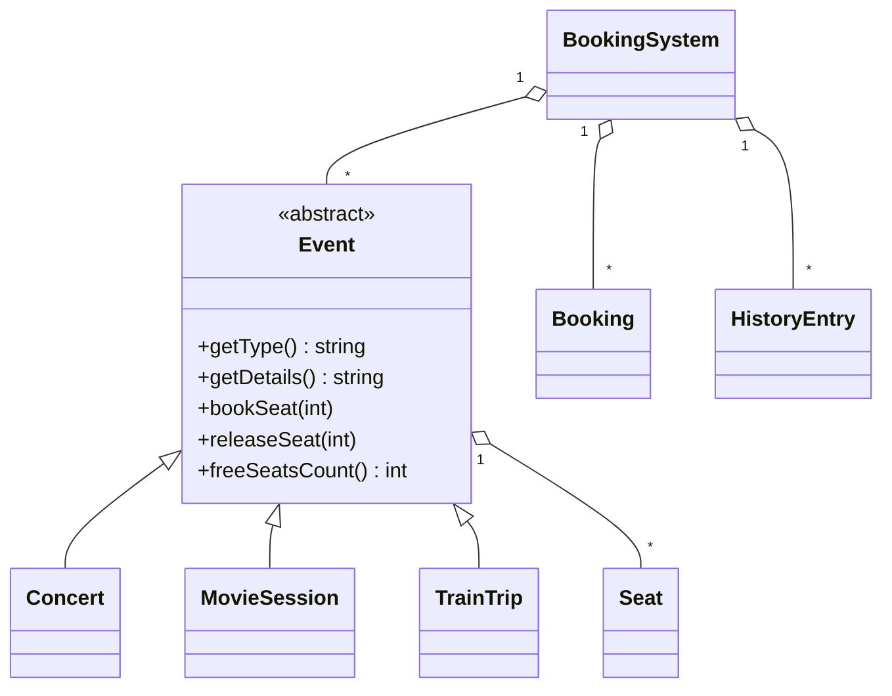
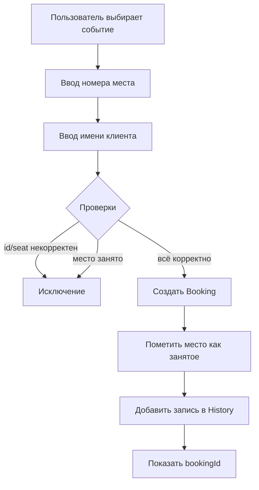
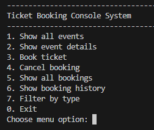
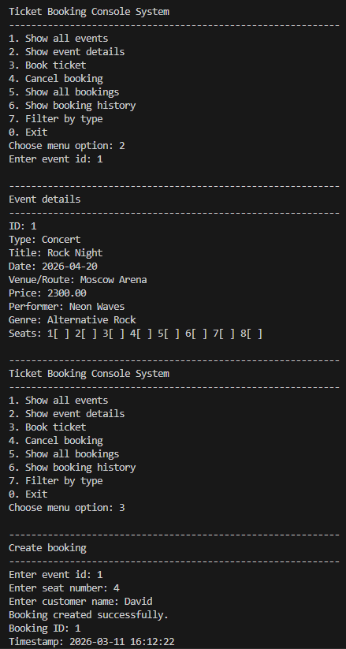

# 🎟️ Ticket Booking Console System

[](https://en.cppreference.com/w/cpp/23)
[](https://cmake.org/)
[](https://github.com/google/googletest)
[](#-примеры-консольного-интерфейса)

> Учебный проект на C++23: простая и аккуратная консольная система бронирования билетов для концертов, киносеансов и поездок.

---

## 📚 Оглавление

- [Краткое описание](#-краткое-описание)
- [Возможности](#-возможности)
- [Почему это ООП + modern C++](#-почему-это-ооп--modern-c)
- [Архитектура](#-архитектура-проекта)
- [Схема классов](#-схема-классов)
- [Поток бронирования](#-схема-потока-бронирования)
- [Quick Start](#-quick-start)
- [Сборка](#-инструкция-по-сборке)
- [Запуск приложения](#-инструкция-по-запуску)
- [Запуск тестов](#-инструкция-по-запуску-тестов)
- [Примеры интерфейса](#-примеры-консольного-интерфейса)
- [Структура проекта](#-структура-проекта)
- [Использованные возможности C++](#-использованные-возможности-c)
- [Тестовые сценарии](#-примеры-тестовых-сценариев)
- [Demo-сценарии и скриншоты](#-demo-сценарии-и-скриншоты)
- [FAQ](#-faq)
- [Что можно улучшить](#-что-можно-улучшить-в-будущем)
- [Автор](#-авторский-блок)

---

## 🧾 Краткое описание

`Ticket Booking Console System` хранит данные в памяти и предоставляет меню для:

- просмотра событий и поездок;
- бронирования мест;
- отмены брони;
- просмотра всех броней и истории действий;
- фильтрации событий по типу.

---

## 🚀 Возможности

| Возможность | Что делает |
|---|---|
| Список всех событий | Показывает id, тип, название, дату, маршрут/локацию, цену и свободные места |
| Детали события | Выводит расширенную информацию по выбранному id |
| Бронирование | Бронь по `eventId + seatNumber + customerName` |
| Защита от дубля | Нельзя забронировать занятое место второй раз |
| Отмена брони | Отмена по `bookingId` |
| История действий | Фиксирует `Created` и `Canceled` |
| Фильтрация | Отдельный просмотр `Concert`, `MovieSession`, `TrainTrip` |
| Обработка ошибок | Неверный id, несуществующее место, пустое имя и др. |

---

## 🧠 Почему это ООП + modern C++

| Критерий | Где показан |
|---|---|
| Полиморфизм | Базовый класс `Event` + наследники `Concert`, `MovieSession`, `TrainTrip` |
| `std::unique_ptr` | Хранение событий в `BookingSystem`: `std::vector<std::unique_ptr<Event>>` |
| `std::optional` | Поиск события/брони, поиск первого свободного места |
| Exceptions | `BookingException`, `EventNotFoundException`, `SeatAlreadyBookedException`, `BookingNotFoundException` |
| RAII | Только стандартные контейнеры и объекты, без `new/delete` |
| `constexpr` | `BookingSystem::MAX_MENU_ITEM` и константы меню в UI |

---

## 🏗️ Архитектура проекта

Проект разделен на два слоя:

1. **Core-логика** (`BookingSystem`, модели, исключения)  
   Не зависит от консольного ввода/вывода.
2. **UI-слой** (`main.cpp`)  
   Отвечает за меню, ввод пользователя и форматированный вывод.

Это позволяет тестировать именно бизнес-логику отдельно от интерфейса.

---

## 🧩 Схема классов



---

## 🔁 Схема потока бронирования



---

## ⚡ Quick Start

```bash
cmake -S . -B build -DBUILD_TESTING=ON
cmake --build build
./build/ticket_booking_app
ctest --test-dir build --output-on-failure
```

> На Windows исполняемый файл обычно: `build\ticket_booking_app.exe`

---

## 🛠️ Инструкция по сборке

```bash
cmake -S . -B build -DBUILD_TESTING=ON
cmake --build build
```

---

## ▶️ Инструкция по запуску

```bash
./build/ticket_booking_app
```

Для Windows:

```powershell
.\build\ticket_booking_app.exe
```

---

## ✅ Инструкция по запуску тестов

```bash
ctest --test-dir build --output-on-failure
```

Или запуск конкретного бинарника тестов:

```bash
./build/tests/ticket_booking_tests
```

---

## 💻 Примеры консольного интерфейса

```text
1. Show all events
2. Show event details
3. Book ticket
4. Cancel booking
5. Show all bookings
6. Show booking history
7. Filter by type
0. Exit
```

```text
Выберите пункт меню: 3
Введите id события: 1
Введите номер места: 2
Введите имя клиента: Ivan Petrov
Бронь создана успешно.
Booking ID: 1
```

```text
Выберите пункт меню: 4
Введите id брони: 1
Бронь 1 отменена.
```

---

## 📁 Структура проекта

```text
.
├── CMakeLists.txt
├── README.md
├── .gitignore
├── include
│   ├── Booking.h
│   ├── BookingSystem.h
│   ├── Concert.h
│   ├── Event.h
│   ├── Exceptions.h
│   ├── HistoryEntry.h
│   ├── MovieSession.h
│   ├── Seat.h
│   └── TrainTrip.h
├── src
│   ├── BookingSystem.cpp
│   ├── Event.cpp
│   └── main.cpp
├── tests
│   ├── BookingSystemTests.cpp
│   └── CMakeLists.txt
└── docs
    └── images
        └── README.md
```

---

## 🔧 Использованные возможности C++

<details>
<summary>Развернуть список</summary>

- `std::unique_ptr` для полиморфного хранения событий.
- `std::optional` для безопасного поиска сущностей.
- Кастомные исключения для ошибок бизнес-логики.
- RAII через `std::vector`, `std::string`, `std::unique_ptr`.
- `constexpr` для лимита пунктов меню.
- `enum class` для статусов и типов действий.

</details>

---

## 🧪 Примеры тестовых сценариев

| Тест | Проверка |
|---|---|
| `BookSeatCreatesBooking...` | Успешное бронирование и уменьшение свободных мест |
| `BookingSameSeatTwice...` | Повторная бронь места вызывает исключение |
| `CancelBooking...` | Успешная отмена меняет статус и освобождает место |
| `CancelMissingBooking...` | Отмена несуществующей брони |
| `FindEventById...` | Поиск события по id |
| `FilterByType...` | Корректная фильтрация типов |
| `EmptyCustomerName...` | Ошибка при пустом имени |
| `HistoryContains...` | Записи Created/Canceled в истории |

---

## 🎬 Demo-сценарии и скриншоты

Медиа-файлы:

<table>
  <tr>
    <td align="center">
      
    </td>
    <td align="center">
      
    </td>
  </tr>
  <tr>
    <td align="center"><b>Menu Demo</b></td>
    <td align="center"><b>Booking Demo</b></td>
  </tr>
</table>

<p align="center">
  
</p>

---

## ❓ FAQ

<details>
<summary>Почему нет базы данных?</summary>

По ТЗ это локальный учебный проект, данные хранятся в памяти.

</details>

<details>
<summary>Почему нет GUI?</summary>

Задача ограничена консольным интерфейсом, чтобы сосредоточиться на core-логике и ООП.

</details>

<details>
<summary>Можно ли добавить сохранение в файл?</summary>

Да, как дополнительное улучшение, но сейчас это не обязательная часть.

</details>

---

## 🌱 Что можно улучшить в будущем

1. Добавить сохранение/загрузку состояния из файла.
2. Добавить валидацию формата даты.
3. Реализовать пагинацию для длинных списков событий.
4. Добавить отдельные интеграционные тесты для CLI.
5. Добавить поддержку нескольких классов вагонов/залов.

---

## 👨‍🎓 Авторский блок

Проект выполнен в формате учебной работы по C++: акцент на читаемом коде, корректной бизнес-логике, базовом полиморфизме и тестируемости.  
Архитектура сознательно удерживается простой и понятной, без переусложнения.
